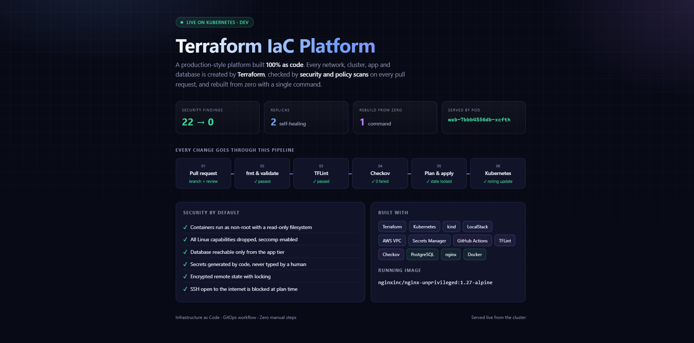
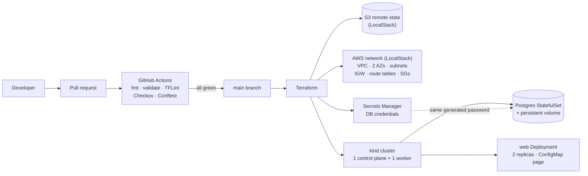
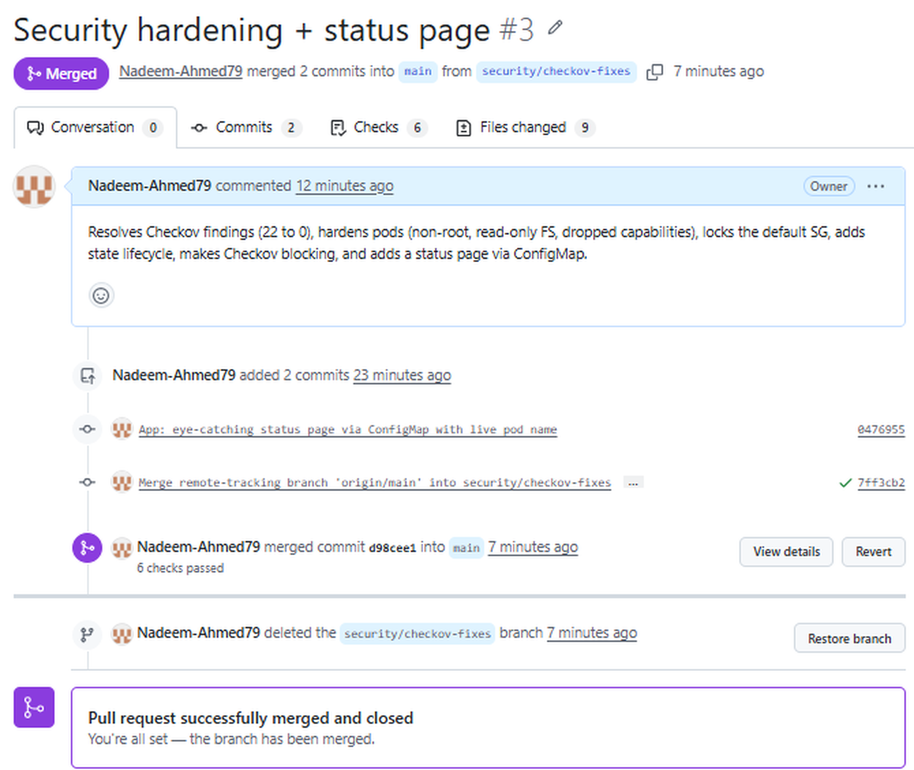

# Terraform IaC Platform

A production-style Infrastructure as Code project that runs entirely on a laptop at zero cloud cost.
An AWS network, a Kubernetes cluster, a hardened web app and a PostgreSQL database are all created by
Terraform, and every change passes formatting, linting, security scanning and custom policy checks
before it can be merged.




## Highlights

- **4 reusable Terraform modules**: network, cluster, app, database
- **Remote state** in S3 with native locking, versioning, encryption and a lifecycle rule
- **Security scan 22 → 0**: real risks fixed, accepted risks documented inline with a reason
- **7 OPA/Conftest policies** with 11 unit tests, run against the real Terraform plan
- **Hardened workloads**: non-root, read-only filesystem, all Linux capabilities dropped, seccomp
- **One command** rebuilds the whole environment from zero: `./scripts/rebuild.sh`

## Architecture



### Network

| Tier | CIDR | Route to internet |
|---|---|---|
| Public subnets (2 AZs) | `10.0.0.0/24`, `10.0.1.0/24` | Internet Gateway |
| Private subnets (2 AZs) | `10.0.10.0/24`, `10.0.11.0/24` | None (optional NAT, off by default to save cost) |

| Security group | Allows |
|---|---|
| `web-sg` | 80/443 from the internet |
| `db-sg` | 5432 **only from `web-sg`** (identity-based, not IP-based) |
| `ssh-sg` | 22 from an admin CIDR. `0.0.0.0/0` is rejected by a variable validation |
| default SG | Locked down with no rules |

## Guardrails

Every pull request runs these checks in [GitHub Actions](.github/workflows/terraform-ci.yml). A failure blocks the merge.

| Check | What it catches |
|---|---|
| `terraform fmt` | Formatting drift |
| `terraform validate` | Syntax and reference errors (matrix over each root module) |
| TFLint | Unused declarations, missing types, deprecated syntax |
| Checkov | Security misconfigurations (blocking, no soft-fail) |
| Conftest `verify` | Unit tests for the custom policies |

### Custom policies ([`policies/`](policies))

Written in Rego and evaluated against the JSON of a real `terraform plan`, so they see final values and planned actions.

| # | Rule | Effect |
|---|---|---|
| 1 | AWS resources must have `owner`, `env`, `project` tags | deny |
| 2 | No ingress covering port 22 from `0.0.0.0/0` (port ranges included) | deny |
| 3 | No "all traffic" ingress from the internet | deny |
| 4 | Container images must be pinned (no `:latest`, no missing tag) | deny |
| 5 | Every container needs resource limits | deny |
| 6 | Deployments must run as non-root (StatefulSets get a warning) | deny / warn |
| 7 | Stateful resources (StatefulSet, PVC, secrets, S3) must never be deleted or replaced | deny |

Example: increasing the database disk from `1Gi` to `2Gi` looks harmless, but it forces the StatefulSet to be
replaced. Policy 7 stops it before any data is lost:

```text
FAIL - LIFECYCLE: module.database.kubernetes_stateful_set_v1.postgres would be DELETED ["delete", "create"]
```

### Security scan: 22 findings → 0

| Decision | Examples |
|---|---|
| **Fixed** | Pod security context, non-root nginx on port 8080, read-only root filesystem, dropped capabilities, liveness probe, locked default SG, state version lifecycle |
| **Accepted with a written reason** | Public web tier on port 80, services that LocalStack does not emulate (flow logs, replication), customer-managed KMS planned for real AWS |

Every accepted risk is an inline `# checkov:skip=<ID>:<reason>` comment next to the resource, so reviewers can see what was skipped and why.

## Quick start

### Prerequisites

Docker, Terraform ≥ 1.10, kubectl, kind, and a free [LocalStack](https://app.localstack.cloud) account for the auth token.

```bash
git clone https://github.com/Nadeem-Ahmed79/terraform-iac-pipeline.git
cd terraform-iac-pipeline

cp .env.example .env          # then paste your LocalStack auth token into .env
./scripts/rebuild.sh          # LocalStack + state bucket + network + cluster + app + database
```

Open the status page:

```bash
export KUBECONFIG=$(terraform -chdir=infra/envs/dev output -raw kubeconfig_path)
kubectl port-forward -n demo svc/web 8080:80
# browse to http://localhost:8080
```

Check the plan against the policies:

```bash
./scripts/policy-check.sh
```

## Repository layout

```text
.
├── .github/workflows/terraform-ci.yml   # CI: fmt, validate, TFLint, Checkov, Conftest
├── docker-compose.yml                   # LocalStack
├── infra/
│   ├── bootstrap/                       # S3 state bucket (versioned, encrypted, lifecycle)
│   ├── envs/dev/                        # Root module: wires the 4 modules together
│   └── modules/
│       ├── network/                     # VPC, subnets, IGW, routes, security groups
│       ├── cluster/                     # kind cluster
│       ├── app/                         # Namespace, ConfigMap, Deployment, Service
│       └── database/                    # Password, Secrets Manager, Postgres StatefulSet
├── policies/                            # Rego policies + unit tests
└── scripts/
    ├── rebuild.sh                       # Build everything from zero
    └── policy-check.sh                  # Plan → JSON → Conftest (deletes plan.json afterwards)
```

## Design notes

- **LocalStack and kind instead of AWS and EKS** keep the cost at zero. Moving to real AWS means removing the
  `endpoints` block in [`providers.tf`](infra/envs/dev/providers.tf) and swapping the cluster module for EKS.
- **Terraform state contains secrets in plain text.** The state bucket is encrypted, blocks public access and is never
  committed. `policy-check.sh` deletes `plan.json` on exit for the same reason.
- **Kubernetes Secrets are only base64-encoded.** For production, External Secrets Operator would sync them from Secrets Manager.
- **ConfigMap changes do not restart pods by themselves.** A `checksum/content` annotation on the pod template triggers a rolling update whenever the page changes.
- **`count` vs `for_each`:** subnets use `count`. Removing an AZ from the start of the list would shift indexes and
  recreate subnets; `for_each` keyed by AZ name is the planned refactor.
- **Cluster and apps share one stack** to keep the demo simple. In production they would be separate stacks so the Kubernetes provider never depends on a cluster being created in the same apply.

## Roadmap

- [ ] Scheduled drift detection that opens a GitHub issue
- [ ] Infracost cost estimate on every pull request
- [ ] `for_each` refactor for subnets
- [ ] External Secrets Operator
- [ ] Real AWS target (EKS + RDS) behind the same modules


